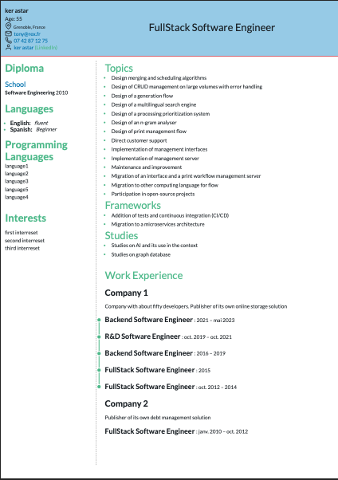

# JSON Resume Template simple

This project provides a **resume template** that can be used with the external project [CV_generator_from_JSON](https://github.com/corentinffoucault/CV_generator_from_JSON).

It is inspired by the [`jsonresume-theme-even`](https://www.npmjs.com/package/jsonresume-theme-even) theme available on npm.

Type safety is ensured by the submodule [json_cv_schema](https://github.com/corentinffoucault/json_cv_schema)

---

## Preview



---

## Purpose

The template is designed to generate a clean and modern **HTML CV** from a structured **JSON resume**.  
It can be reused across projects, making it easy to keep your resume consistent, customizable, and portable.

---

## Installation

Requirements:
- **Node.js** v22 or higher
- **npm** v11 or higher

```bash
git clone --recurse-submodules https://github.com/corentinffoucault/typescript_cv_template_simple.git
cd typescript_cv_template_simple
npm install-recursive
npm run build
``` 

---

## How to use

This repository is not meant to be used directly.  
Instead, it acts as a **template dependency** for [CV_generator_from_JSON](https://github.com/corentinffoucault/CV_generator_from_JSON).

To see how to use it you can read this [readme](https://github.com/corentinffoucault/CV_generator_from_JSON)

---

## Test

Tests have been added to ensure the stability and reliability of the project.
To run them, use the following command:

```bash
npm run test
```

---

The tests verify that the template correctly generates the expected files and conforms to the JSON schema defined in json_cv_schema